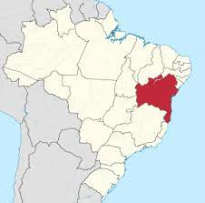

```{r setup, include=FALSE}
library(flexdashboard)
library(ISLR)
library(car)
library(olsrr)

dados_venda <- Carseats

fit1 <- lm(formula = Sales ~ CompPrice + Income + Advertising + Price + ShelveLoc + Age + Income:Advertising, data = dados_venda)


```

Primeira Aba
===================================== 

Column {data-width=500}
-----------------------------------------------------------------------

### Bahia

```{r echo=FALSE, out.width="60%", fig.cap="BAHIA, RECEBA!"}

```

### Contas

```{r, echo=TRUE}
1 + 1
```


Column {data-width=500}
-----------------------------------------------------------------------

### Gráfico de resíduos

```{r}
ols_plot_resid_fit(fit1)
```


Interpretações
===================================== 

Aprendemos como inserir imagens e códigos no flexdashboard

